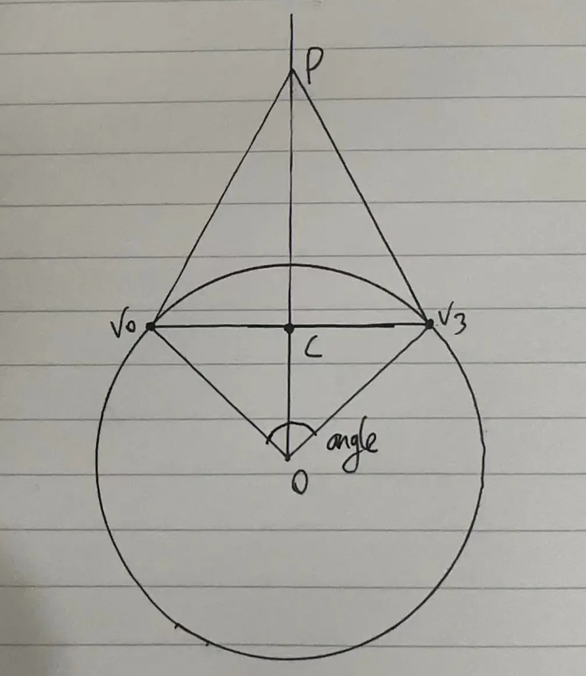
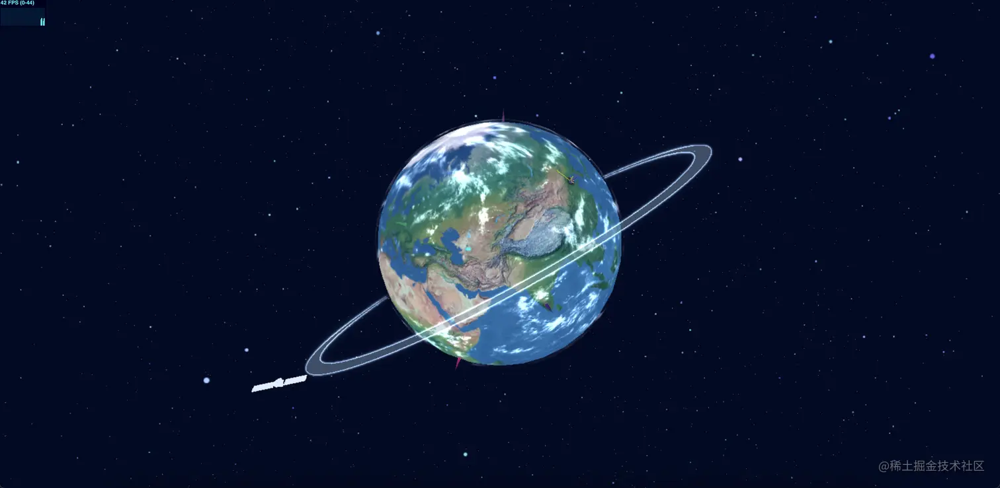

# 使用threejs从基础开始构建3D地球

在该demo中各位能学到什么：

- 使用粒子效果模拟宇宙星空
- 贴图、模型等资源的加载
- 加载资源的监听
- 效果合成器EffectComposer的初级使用
- 在地球上设置坐标以及坐标涟漪动画
- 标点间建立飞线
- 以及一些简单动画

## 场景创建

```js
let scene: THREE.Scene = new THREE.Scene();
```

## 相机

透视相机：PerspectiveCamera( fov : Number, aspect : Number, near : Number, far : Number )

- fov — 摄像机视锥体垂直视野角度
- aspect — 摄像机视锥体长宽比
- near — 摄像机视锥体近端面
- far — 摄像机视锥体远端面

```js
const initCamera = (width: number, height: number): void => {
  camera = new THREE.PerspectiveCamera(75, width / height, 0.1, 40);
  // 设置相机位置
  camera.position.set(0, 0, 40);
  // 将相机添加到场景中
  scene.add(camera);
};
```

## 坐标辅助器

```js
const initAxesHelper = (): void => {
  const axesHelper: THREE.AxesHelper = new THREE.AxesHelper(50);
  scene.add(axesHelper);
};
```

## 状态检测器

```js
const initStats = (): void => {
  stats = new Stats();
  canvas.value.appendChild(stats.dom);
};
```

## 渲染器

这里说一下，有些同学在网上看的教程会有使用 WebGL1Renderer 来创建渲染器，那到底是使用WebGLRenderer还是WebGL1Renderer，接下来我们来了解下这两的区别
如果看过WebGL的同学应该知道WebGL有1和2两个版本，从r118起，WebGLRenderer会自动使用WebGL2来做渲染
那么这两个版本有何区别，简单说就是多了更多纹理格式、内置函数、3D 纹理贴图，同时还支持了非2的整数次方大小的图片。同时，WebGL2 与 WebGL1 在对浏览器的兼容性上有很大的差异，这两者对浏览器兼容产生的巨大差异会导致陈旧的WebGL1的系统崩溃，所以threejs给我们提供了WebGL1Renderer来进行适配兼容

```js
const initRenderer = (width: number, height: number): void => {
  renderer = new THREE.WebGLRenderer();
  renderer.setSize(width, height);
  canvas.value.appendChild(renderer.domElement);
  renderer.render(scene, camera);
};
```

## 轨道控制器

```js
const initControls = (): void => {
  controls = new OrbitControls(camera, renderer.domElement);
  // 使动画循环使用时阻尼或自转 意思是否有惯性
  controls.enableDamping = true;
  //是否可以缩放
  controls.enableZoom = true;
  //是否自动旋转
  controls.autoRotate = false;
  //是否开启右键拖拽
  controls.enablePan = true;
};
```

大致的场景创建完成, 接下来才是本文的重点!!!

## 粒子星空

```js
const createStar = (): void => {
  let geometry: THREE.BufferGeometry = new THREE.BufferGeometry();
  // 顶点集合
  let vertices: Float32Array = new Float32Array(starCount * 3);
  // 随机颜色集合
  let colors: Float32Array = new Float32Array(starCount * 3);

  for (let i = 0; i < starCount; i++) {
    // -500 ～ 500
    let x = (Math.random() - 0.5) * 1000;
    let y = (Math.random() - 0.5) * 1000;
    let z = (Math.random() - 0.5) * 1000;
    // 解释下这个算法
    // [
    //  x1,y1,z1,
    //  x2,y2,z2,
    //  x3,y3,z3
    // ]
    // 因为每个顶点都是一个三元组，所以[1 * 3 + 0]则是第一组的x轴，[2 * 3 + 0]则是第二组的x轴，以此类推，其他也是一样的算法
    
    vertices[i * 3 + 0] = x;
    vertices[i * 3 + 1] = y;
    vertices[i * 3 + 2] = z;
    
    // 随机颜色
    let color: THREE.Color = new THREE.Color();
    // setHSL(‘色调', '亮度', ‘饱和‘) 三个参数皆在[0, 1]之间
    color.setHSL(Math.random() * 0.2 + 0.5, 0.55, Math.random() * 0.25 + 0.55);
    colors[i * 3 + 0] = color.r;
    colors[i * 3 + 1] = color.g;
    colors[i * 3 + 2] = color.b;
  }

  geometry.setAttribute("position", new THREE.BufferAttribute(vertices, 3));
  geometry.setAttribute("color", new THREE.BufferAttribute(colors, 3));

  let starTexture: THREE.Texture = textureLoader.load(getAssetsFile("star.png"));
  let starMaterial = new THREE.PointsMaterial({
    map: starTexture,
    size: 1, // 点大小
    transparent: true, // 材质透明
    opacity: 1, // 透明度
    vertexColors: true, // 顶点着色
    depthTest: true, // 是否在渲染此材质时启用深度测试
    depthWrite: false, // 渲染此材质是否对深度缓冲区有任何影响
    blending: THREE.AdditiveBlending, // 材质混合
    sizeAttenuation: true, // 点的大小是否因相机深度而衰减
  });
  stars = new THREE.Points(geometry, starMaterial);

  scene.add(stars);
};

```

## 地球创建

```js
const createEarth = () => {
  // 地球
  // 创建球形几何体
  const earthGeo: THREE.SphereGeometry = new THREE.SphereGeometry(5, 32, 32);
  // 贴图加载
  const earthTexture: THREE.Texture = textureLoader.load(getAssetsFile("earth/earth.png"));
  const earthBumpTexture: THREE.Texture = textureLoader.load(getAssetsFile("earth/earth_bump.png"));
  const earthSpecTexture: THREE.Texture = textureLoader.load(getAssetsFile("earth/earth_spec.png"));
  // 高光材质
  const earthMaterial: THREE.MeshPhongMaterial = new THREE.MeshPhongMaterial({
    map: earthTexture, // 贴图
    bumpMap: earthBumpTexture, // 凹凸贴图纹理
    bumpScale: 0.15, // 凹凸贴图会对材质产生多大影响 0～1
    specularMap: earthSpecTexture, // 镜面反射贴图
    specular: new THREE.Color("#909090"), // 材质的高光颜色
    shininess: 5, // 高亮的程度，越高越亮
    transparent: true, // 材质透明
    side: THREE.DoubleSide // 定义将要渲染哪一面，THREE.DoubleSide是两面
  });
  const earth: THREE.Mesh = new THREE.Mesh(earthGeo, earthMaterial)
  earthGroup.add(earth)

  // 大气层
  const cloudGeo: THREE.SphereGeometry = new THREE.SphereGeometry(5.1, 40, 40)
  const cloudTexture: THREE.Texture = textureLoader.load(getAssetsFile("earth/earth_cloud.png"));
  const cloudMaterial: THREE.MeshPhongMaterial = new THREE.MeshPhongMaterial({
    map: cloudTexture,
    transparent: true,
    opacity: 1,
    blending: THREE.AdditiveBlending,
    side: THREE.DoubleSide
  })
  const cloud: THREE.Mesh = new THREE.Mesh(cloudGeo, cloudMaterial)
  earthGroup.add(cloud)

  // 设置地球组转向
  earthGroup.rotation.set( 0.5, 0, -0.4 );

  meshGroup.add(earthGroup)
  scene.add(meshGroup)
};

```

## 创建星轨环

有关效果合成器通道的使用在R149版本中文档并无介绍，所以选择直接查看代码

RenderPass: https://github.com/mrdoob/three.js/blob/r149/examples/jsm/postprocessing/RenderPass.js

OutlinePass: https://github.com/mrdoob/three.js/blob/r149/examples/jsm/postprocessing/OutlinePass.js

其他一些通道: https://github.com/mrdoob/three.js/tree/r149/examples/jsm/postprocessing

```js
const createStarOrbit = (): void => {
  // 创建环形几何体
  const torusGeo: THREE.TorusGeometry = new THREE.TorusGeometry(8.0, 0.2, 2, 200)
  const torusMaterial: THREE.MeshBasicMaterial = new THREE.MeshBasicMaterial({
    color: new THREE.Color("rgb(147, 181, 207)"),
    transparent: true,
    opacity: 0.4
  });
  torus = new THREE.Mesh(torusGeo, torusMaterial);
  torus.rotation.set( 1.7, 0.5, 1 );
  torus.updateMatrix();

  // 效果合成器，是Three.js中的一个后期处理效果库。EffectComposer允许您将多个RenderPass组合在一起，以创建复杂的后期处理效果
  composer = new EffectComposer( renderer )

  // 通用的渲染器通道，用于将场景渲染到纹理或屏幕上
  const renderPass: RenderPass = new RenderPass( scene, camera );
  composer.addPass( renderPass );
  
  // 后期处理通道，可以在场景中的对象周围创建一个轮廓线
  const outlinePass: OutlinePass = new OutlinePass( new THREE.Vector2( canvas.value.clientWidth, canvas.value.clientHeight ), scene, camera );
  composer.addPass( outlinePass );

  outlinePass.pulsePeriod = 0; // 数值越大，律动越慢
  outlinePass.visibleEdgeColor.set( new THREE.Color("rgb(147, 181, 207)") ); // 高光颜色
  outlinePass.usePatternTexture = false; // 使用纹理覆盖
  outlinePass.edgeStrength = 2; // 高光边缘强度
  outlinePass.edgeGlow = 1; // 边缘微光强度
  outlinePass.edgeThickness = 1; // 高光厚度
  outlinePass.selectedObjects = [torus]; // 需要后期的Mesh

  meshGroup.add(torus)
}
```

## 创建卫星移动轨迹

该方法主要是创建发圆环所需要的顶点以及圆环旋转后顶点的更新

如何的到圆上每个点的坐标？？？

根据三角函数正弦、余弦求得，假设圆心P(0, 0, 0)，半径r(9)，一共length300个点，循环长度的到坐标位置 i

```js
x = r * Math.sin(Math.PI * 2 * i / length) + p.x
y = r * Math.cos(Math.PI * 2 * i / length) + p.y
```

```js
const createMoveTrack = (): void => {
  // number 轨迹环总长度  radius 轨迹环半径   centerPoint 圆心   pointsArr 向量组合
  const length: number = 300, 
        radius: number = 9, 
        centerPoint = { x: 0, y: 0, z: 0 }, 
        pointsArr: THREE.Vector3[] = [];

  // 通过三角函数计算圆上点坐标
  // 根据三角函数正弦、余弦求得，假设圆心P(0, 0, 0)，半径r(9)，一共length300个点，循环长度的到坐标位置i
  // x = r * Math.sin(Math.PI * 2 * i / length) + p.x
  // y = r * Math.cos(Math.PI * 2 * i / length) + p.y
  for (let i = 0; i <= length; i++) {
    pointsArr.push(
      new THREE.Vector3(
        radius * Math.sin(Math.PI * 2 * i / length) + centerPoint.x,
        radius * Math.cos(Math.PI * 2 * i / length) + centerPoint.y,
        centerPoint.z
      )
    )
  }
  // 3阶段贝塞尔曲线
  curve = new THREE.CatmullRomCurve3(pointsArr, true, 'catmullrom', 0.5);
  // 分成50个点
  const points: THREE.Vector3[] = curve.getPoints(50);
  // 建立轨迹线并设置完全透明隐藏起来
  const lineGeo: THREE.BufferGeometry = new THREE.BufferGeometry().setFromPoints(points);
  const lineMaterial: THREE.LineBasicMaterial = new THREE.LineBasicMaterial({ transparent: true, opacity: 0 })
  const line = new THREE.Line(lineGeo, lineMaterial)
  // 设置跟星轨一样的转向，这样到卫星看起来就会在轨迹环边运动
  line.rotation.set( 1.7, 0.5, 1 );

  // 物体旋转移动后顶点不更新
  // 创建一个四维矩阵
  // 然后将torus.rotation创建一个旋转矩阵并赋值给matrix
  // 最后将旋转矩阵应用于curve的顶点
  // 通过applyMatrix4(matrix)方法，curve.points[i]对象的坐标会根据旋转矩阵matrix进行变换，从而实现旋转效果
  const matrix = new THREE.Matrix4();
  matrix.makeRotationFromEuler(torus.rotation);
  for (let i = 0; i < curve.points.length; i++) {
    curve.points[i].applyMatrix4(matrix);
  }

  meshGroup.add(line)
}
```

## 创建卫星

卫星我直接从网上嫖了个免费模型

```js
const createSatellite = (): void => {
  mTLLoader.load(getAssetsFile('satellite/Satellite.mtl'), (material) => {
    // 预加载材质所需的所有纹理、贴图
    material.preload()

    objLoader.setMaterials(material).load(getAssetsFile('satellite/Satellite.obj'), (obj) => {
      // 将轨迹路线的第一个坐标设置成卫星的初始位置
      obj.position.copy(curve.points[0])
      satellite = obj
      meshGroup.add(satellite)
    })
  })
}
```

## 二维经纬度坐标转三维球坐标

```js
const lglnToxyz = (lg: number, lt: number, radius: number): THREE.Vector3 => {
  // theta是俯仰面（竖直面）内的角度，范围0~180度
  const theta = (90 + lg) * (Math.PI / 180)
  // phi是方位面（水平面）内的角度，范围0~360度
  const phi = (90 - lt) * (Math.PI / 180)
  // 球坐标
  const spherical = new THREE.Spherical(radius, phi, theta)
  // 三维向量
  const xyz = new THREE.Vector3()
  // 从球坐标中设置该向量
  xyz.setFromSpherical(spherical)

  return xyz
}
```
## 创建标点

```js
const createEarthPoint = (localton: THREE.Vector3, color: string): THREE.Group => {
  // 新建一个标点组合
  const pointGroup: THREE.Group = new THREE.Group();

  // 涟漪圈圈
  const waveGeo: THREE.PlaneGeometry = new THREE.PlaneGeometry( 0.3, 0.3 );
  const waveTexture: THREE.Texture = textureLoader.load(getAssetsFile("wave.png"));
  const waveMaterial: THREE.MeshBasicMaterial = new THREE.MeshBasicMaterial({
    map: waveTexture,
    color: color,
    transparent: true,
    opacity: 1.0,
    side: THREE.DoubleSide,
    depthWrite: false,
  })
  let waveMesh: THREE.Mesh = new THREE.Mesh(waveGeo, waveMaterial);
  // 设置后期控制涟漪动画的大小和透明度阀值
  (waveMesh as any).size = 5.1 * 0.3;
  (waveMesh as any)._s = Math.random() * 1.0 + 1.0;

  wareArr.push(waveMesh)

  // 标点光柱
  // 使用CylinderGeometry创建一个圆锥形圆柱体
  const lightGeo: THREE.CylinderGeometry = new THREE.CylinderGeometry(0, 0.05, 0.5, 32)
  const lightTexture: THREE.Texture = textureLoader.load(getAssetsFile("lightray.png"))
  const lightMaterial: THREE.MeshBasicMaterial = new THREE.MeshBasicMaterial({
    map: lightTexture,
    color: color,
    side: THREE.DoubleSide,
    transparent: true,
    opacity: 1.0,
    depthWrite: false,
  })
  const lightMesh: THREE.Mesh = new THREE.Mesh(lightGeo, lightMaterial)
  // 设置光柱的旋转和位置，让他竖立在涟漪圈上边
  lightMesh.rotateX(Math.PI / 2)
  lightMesh.position.z = 0.25
  

  pointGroup.add(waveMesh, lightMesh)

  pointGroup.position.set(localton.x, localton.y, localton.z)

  // 调用normalize方法归一化向量，好处是保留了原向量信息而长度为1，在计算中更方便
  const coordVec3 = new THREE.Vector3( localton.x, localton.y, localton.z ).normalize();
  const meshNormal = new THREE.Vector3( 0, 0, 1 );
  // setFromUnitVectors方法根据这两个向量计算并设置旋转四元数，使pointGroup中的物体朝向目标点
  pointGroup.quaternion.setFromUnitVectors( meshNormal, coordVec3 );

  return pointGroup
}
```

## 绘制飞线

两点一线，所以最先打算用二阶贝塞尔曲线实现，去两点之间的中点为控制点，后面随机去点时发现当起始点和终止点分别在两极，也就是两点连线为直径时，控制点在无穷远，故这里使用三阶贝塞尔曲线

这里的难点是在于如何通过起始点和终止点算出其他两个控制点，在参考其他大佬的方案以及chatgpt的答疑，最终整理出如下方法，如下图所示




```js
const createFlyLine = (v0: THREE.Vector3, v3: THREE.Vector3): THREE.Line => {
  // v0.angleTo(v3)计算v0和v3之间的夹角，单位为弧度，(弧度 * 180) / Math.PI 将弧度转化为角度，单位为度
  const angle: number = (v0.angleTo(v3) * 180) / Math.PI;
  // 计算控制点的水平距离，将夹角 * 常数(这个常数是个经验值，根据实际情况调整，它的作用是控制曲线的弯曲程度)
  const horizontal: number = angle * 0.04; 
  // 计算了控制点的垂直距离，将夹角的平方 * 常数(这个常数是个经验值，根据实际情况调整，它的作用是控制曲线的高度)
  const vertical: number = angle * angle * 0.1; 
  // 法线向量，球心
  const p0: THREE.Vector3 = new THREE.Vector3(0, 0, 0); 
  // 计算起始点到终止点两点间的中间点，即两向量的平均值
  const centerPoint: THREE.Vector3 = v0.clone().add(v3.clone()).divideScalar(2); 
  // 从圆心到中间点形成无穷远的射线
  const rayLine: THREE.Ray = new THREE.Ray(p0, centerPoint); 
  // rayLine.at需要传两个参数，所以这里创建一个临时变量
  const temp = new THREE.Vector3(); 
  // rayLine.at获取Ray对象起点与终点之间的向量并储存在temp中
  // 从给定点p0开始，沿着给定方向（由Ray对象表示）上的一条射线上，到该射线与垂线所在平面的交点的计算
  let vtop = rayLine.at( vertical / rayLine.at( 1, temp ).distanceTo( p0 ), temp );

  // lerp方法v0到vtop和horizontal / v0.clone().distanceTo(vtop)之间进行插值
  // v0.clone().distanceTo(vtop) 表示向量 v0 到向量 vtop 之间的距离，也就是线段 v0 和 vtop 的长度
  // 将 horizontal 除以线段的长度，实际上是在计算一个在 v0 到 vtop 这条线段上的相对位置，这个相对位置是以 horizontal 所表示的距离来度量的
  // 具体来说，horizontal 可以看作是线段长度的一个比例因子。当 horizontal 的值为 0 时
  // 所得到的向量就是 v0，当 horizontal 的值为线段长度时，所得到的向量就是 vtop。当 horizontal 的值为线段长度的一半时
  // 所得到的向量就是线段的中点。因此，horizontal / v0.clone().distanceTo(vtop) 表示在 v0 到 vtop 这条线段上的相对位置
  // 这个位置是由 horizontal 和线段长度共同决定的
  let v1 = v0.clone().lerp(vtop, horizontal / v0.clone().distanceTo(vtop));      
  let v2 = v3.clone().lerp(vtop, horizontal / v3.clone().distanceTo(vtop));  

  const curve: THREE.CubicBezierCurve3 = new THREE.CubicBezierCurve3( v0, v1, v2, v3 );
  const points: THREE.Vector3[] = curve.getSpacedPoints( 100 );
  const lineGeo: THREE.BufferGeometry = new THREE.BufferGeometry().setFromPoints(points)
  const lineMaterial = new THREE.LineBasicMaterial( {
    color: new THREE.Color('rgb(255, 255, 255)'),
    linewidth: 1,
    transparent: true,
    opacity: 0
  });
  const line: THREE.Line = new THREE.Line(lineGeo, lineMaterial)
  scene.add(line)

  // 从0开始，每次取5个点的数量
  const index = 0, num = 5 
  // 从曲线上取一段
  let flyLinePoints = points.splice(index, index + num) 
  let flyLineGeo = new THREE.BufferGeometry().setFromPoints(flyLinePoints);
  (flyLineGeo as any).points = points;
  (flyLineGeo as any).num = num;
  (flyLineGeo as any)._index = index;
  var flyLineMaterial = new THREE.LineBasicMaterial({
    linewidth: 1,
    color: new THREE.Color('rgb(254, 215, 26)')
  });
  var flyLine = new THREE.Line(flyLineGeo, flyLineMaterial);
  flyLineArr.push(flyLine);

  return flyLine;
}
```

## 在地球上绘制标点和飞线

```js
const drawPointOnEarth = (): void => {
  // 标点集合
  const localtionGroup: THREE.Group = new THREE.Group();
  // 飞线集合
  const flyLineGroup: THREE.Group = new THREE.Group()
  for(let i  = 0; i < lnglatData.length; i++) {
    lnglatData[i].lnglat.forEach((lnglat: number[]) => {
      const xyz = lglnToxyz(lnglat[0], lnglat[1], 5.1)
      localtionGroup.add(createEarthPoint(xyz, lnglatData[i].color))
    })

    const from = lglnToxyz(lnglatData[i].lnglat[0][0], lnglatData[i].lnglat[0][1], 5.1)
    const to = lglnToxyz(lnglatData[i].lnglat[1][0], lnglatData[i].lnglat[1][1], 5.1)
    flyLineGroup.add(createFlyLine(from, to))
  }
  earthGroup.add(localtionGroup, flyLineGroup)
}
```
一般在执行完上述方法后能看到如下图的效果：



最后加上动画效果

## 动画实现

飞线这部分感觉还可以继续优化，希望大佬们可以指点指点

```js
const render = (): void => {
  controls.update();
  renderer.render(scene, camera);
  if (stats) {
    stats.update();
  }

  if(composer) {
    composer.render();
  }
  
  if(stars){
    stars.rotation.y += 0.0009;
    stars.rotation.z -= 0.0003;
  }
  
  // 卫星公转
  if(satellite) {
    if (progress <= 1 - velocity) {
      const satelliteMovePosition  = curve.getPointAt(progress + velocity)
      progress += velocity
      satellite.position.copy(satelliteMovePosition)
    } else {
      progress = 0
    }
  }
    
  // 飞线动画
  if(flyLineArr.length) {
    flyLineArr.forEach(flyLine => {
      let flyLineGeo = flyLine.geometry
      let points = (flyLineGeo as any).points
      let p = JSON.parse(JSON.stringify(points))
      let num = (flyLineGeo as any).num

      let flyLinePoints = p.splice((flyLineGeo as any)._index, (flyLineGeo as any)._index + num)
      flyLineGeo.setFromPoints(flyLinePoints)

      if((flyLineGeo as any)._index < points.length) {
        (flyLineGeo as any)._index += 1
      } else {
        (flyLineGeo as any)._index = 0
      }
    })
  }

  // 涟漪动画
  if(wareArr.length) {
    wareArr.forEach((ware: any) => {
      ware._s += 0.01;
      ware.scale.set( ware.size * ware._s, ware.size * ware._s, ware.size * ware._s );
      if (ware._s <= 1.5) {
        //mesh._s=1，透明度=0 mesh._s=1.5，透明度=1
        ware.material.opacity = ( ware._s - 1 ) * 2;
      } else if (ware._s > 1.5 && ware._s <= 2) {
        //mesh._s=1.5，透明度=1 mesh._s=2，透明度=0
        ware.material.opacity = 1 - ( ware._s - 1.5 ) * 2;
      } else {
        ware._s = 1.0;
      }
    })
  }

  requestAnimationFrame(render);
};
```

## 资源加载监听以及loading实现

```js
const manager = new THREE.LoadingManager(); // 加载器管理器

manager.onProgress = function(item, loaded, total) {
  // 百分比
  let value = loaded / total * 100
  process.value = Math.ceil(value)
  
  // 加载完成1s后执行下列操作
  if(value === 100) {
    setTimeout(() => {
      // 隐藏loading动画
      loading.value = false
      
      // 这边使用gsap实现一组动画
      gsap.to(meshGroup.position, {
        z: 0,
        ease: "Power2.inOut",
        duration: 1,
      })
      gsap.to(earthGroup.rotation, {
        y: 10,
        ease: "Power2.inOut",
        duration: 2,
        onComplete() {
          if(flyLineArr.length === 0) {
            drawPointOnEarth();
          }
        }
      })
    }, 1000)
  }
};
```


